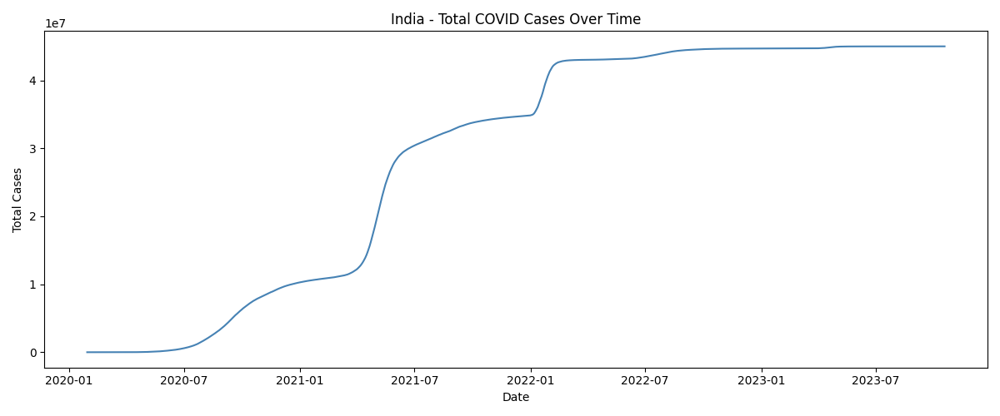
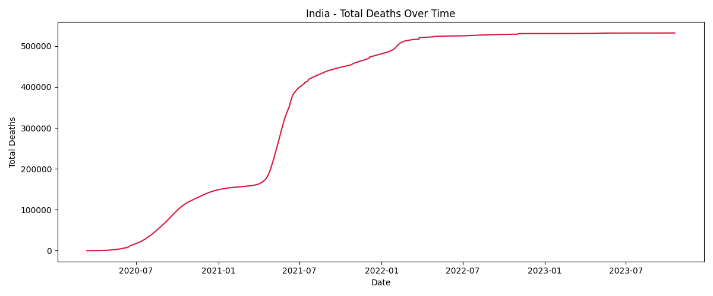
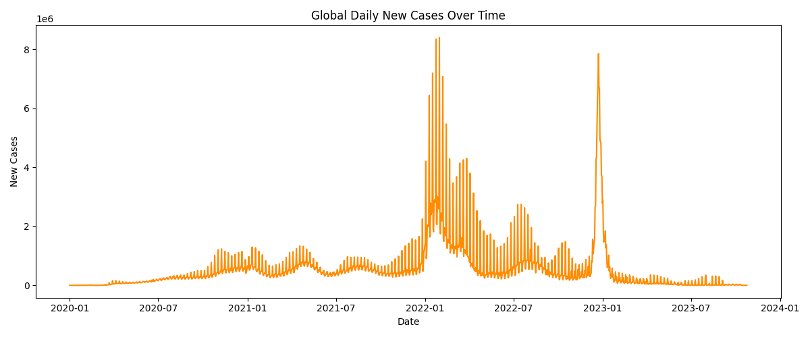
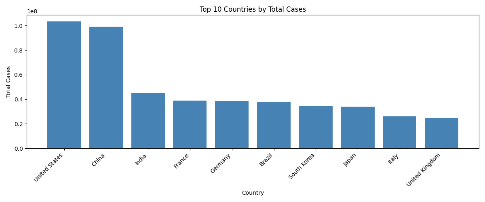
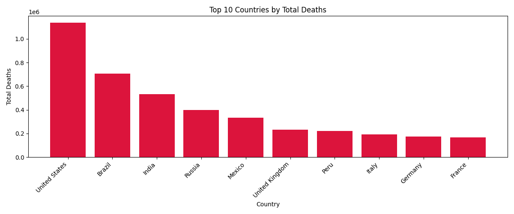
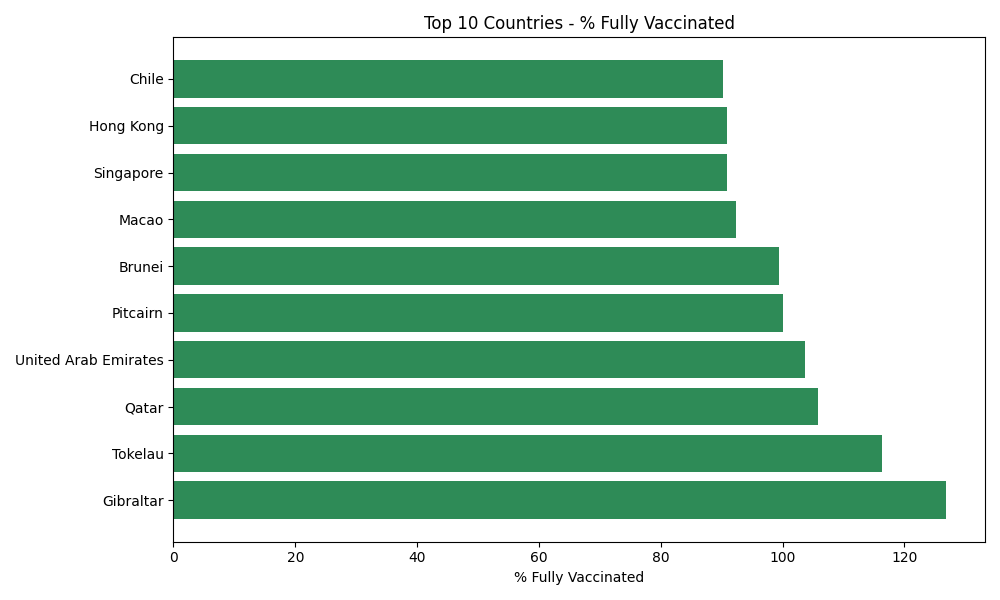
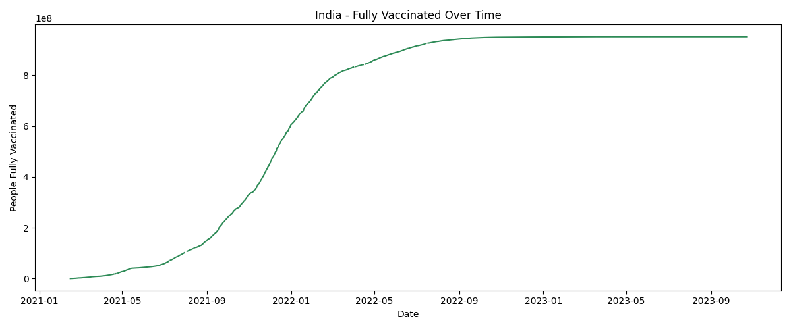

# COVID-19 Data Exploration

Exploratory data analysis on the OWID COVID-19 dataset (333K+ rows, 67 columns).

## Key Findings
- USA had the highest total cases (103M) and deaths (1.1M)
- India's peak new cases were on **May 7, 2021** (second wave)
- Yemen had the highest death rate at **18%**
- Gibraltar was the most fully vaccinated country

## Visualisations

### India - Total Cases Over Time

### India - Total Deaths Over Time

### Global Daily New Cases

### Top 10 Countries by Total Cases

### Top 10 Countries by Total Deaths

### Top 10 Vaccinated Countries

### India Vaccination Timeline

## Tech Stack
Python, pandas, matplotlib, seaborn

## Project Structure
- `src/load_data.py` — data loading and cleaning
- `src/eda.py` — exploratory analysis
- `src/visualise.py` — 7 data visualisations
- `src/insights.py` — key insights
- `main.py` — runs the full pipeline

## How to Run
pip install -r requirements.txt
python main.py